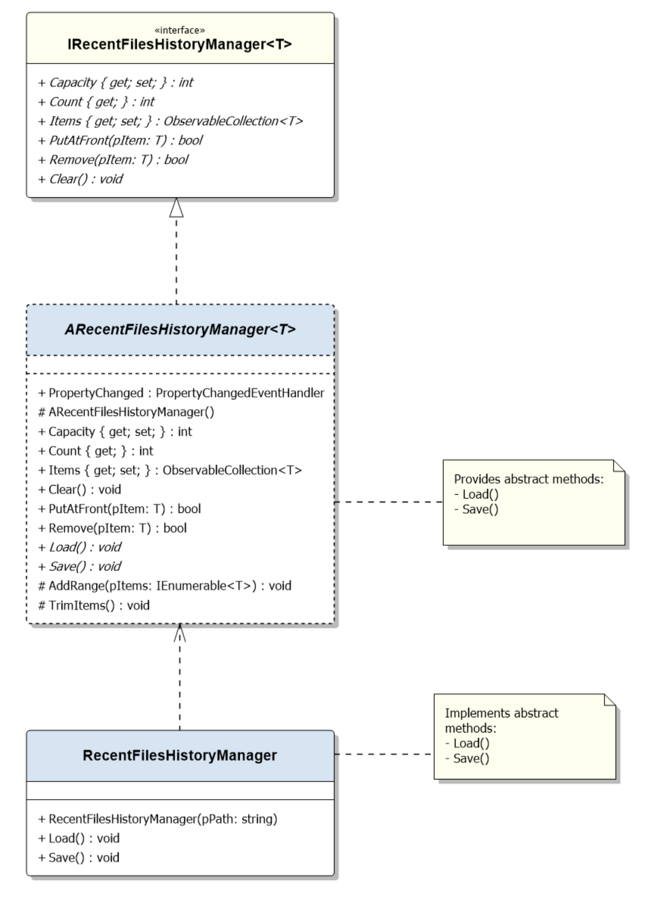

# کتابخانه RecentFilesHistory
این کتابخانه دسترسی به فایل‌ها در برنامه‌های دسکتاپ را ساده و کارآمد می‌کند و ویژگی‌های محبوبی مانند "تاریخچه فایل"، "آخرین فایل‌های باز شده" و "فایل‌های اخیر" را از ویرایشگرها و برنامه‌های طراحی معتبر تجسم می‌کند.

## نمونه استفاده

## نمودار کلاس UML

## چگونگی عملکرد
این کتابخانه شامل کلاس انتزاعی عمومی ژنریک `RecentlyFilesHistoryManager<T>` است که عناصر را در مجموعه `ObservableCollection<T> Items` با استفاده از سیاست حافظه موقت LRU (کمترین استفاده اخیر) مدیریت می‌کند.

برای افزودن یک فایل به تاریخچه، به راحتی از متد `PutAtFront(item)` استفاده کنید. اگر مورد از پیش در مجموعه وجود داشته باشد، به موقعیت اول منتقل می‌شود (به عنوان آخرین استفاده شده در نظر گرفته می‌شود).

برای استفاده از این کتابخانه، کلاس انتزاعی ژنریک را با تعیین نوع داده برای نوع ژنریک پیاده‌سازی کنید. سپس متدهای `Load()` و `Save()` را برای مدیریت تاریخچه فایل‌های اخیرا باز شده، ذخیره شده و بسته شده پیاده‌سازی کنید.

## پروژه نمایشی
شما می‌توانید پروژه نمایشی را کاوش کنید که نشان می‌دهد چگونه از کتابخانه برای مدیریت مسیرهای فایل (رشته‌ها) استفاده کنید.