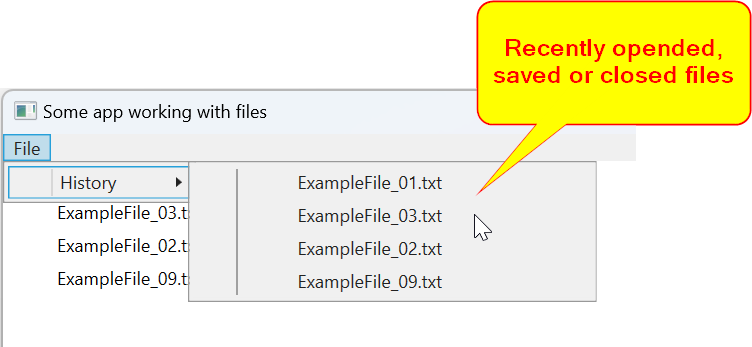

# Библиотека RecentFilesHistory
Эта библиотека облегчает доступ к файлам в рабочих приложениях, предоставляя популярные функции, такие как "История файлов", "Последние открытые файлы" и "Последние файлы", известные известными редакторами и приложениями для дизайна.

## Пример использования

## UML-диаграмма классов

## Как это работает
Библиотека включает в себя обобщенный абстрактный класс `RecentlyFilesHistoryManager<T>`, который управляет элементами в коллекции `ObservableCollection<T> Items` с использованием стратегии кэширования LRU (Наименее недавно использованные).

Чтобы добавить файл в историю, просто используйте метод `PutAtFront(item)`. Если элемент уже существует в коллекции, он будет перемещен на первую позицию (считается самым недавним).

Чтобы использовать эту библиотеку, реализуйте обобщенный абстрактный класс, указав тип данных для обобщенного типа, а затем реализуйте методы `Load()` и `Save()`, чтобы управлять историей недавно открытых, сохраненных и закрытых файлов.

## Проект-демонстрация
Вы можете изучить демонстрационный проект, который показывает, как использовать библиотеку для управления путями к файлам (строками).