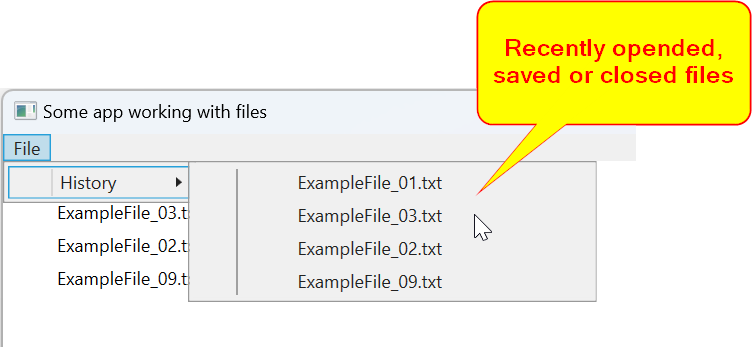
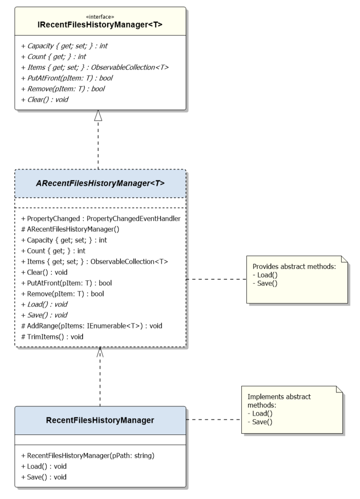

This is the english documentation. Following translations are available:
- [普通话 (Mandarin) :cn:](Documentation/Mandarin.md)
- [Español :es:](Documentation/Spanish.md)
- [Pусский :ru:](Documentation/Russian.md)
- [Deutsch :de: :austria: :switzerland:](Documentation/German.md)
- [हिंदी :india:](Documentation/Hindi.md)
- [Türkçe :tr:](Documentation/Turkish.md)
- [فارسی :iran: :afghanistan: :tajikistan:](Documentation/Farsi.md)
  
# RecentFilesHistory Library
The library Facilitating Easy and Efficient File Access in Desktop Applications, Mirroring Popular Feature like "File History" or "Last Opened Files" or "Recent Files" from Notable Editors and Design Applications. 

## Usage Example

## UML Class Diagram

## How It Works
The library includes the generic abstract class `RecentlyFilesHistoryManager<T>`, which manages elements in the `ObservableCollection<T> Items` using an LRU (Least Recently Used) cache policy.

To add a file to the history, simply use the `PutAtFront(item)` method. If the item already exists in the collection, it will be moved to the first position (considered most recent).

To use this library, implement the generic abstract class by specifying the data type for the generic type. Then, implement the `Load()` and `Save()` methods to manage the history of recently opened, saved, and closed files.

## Demo Project

You can explore the demo project, which demonstrates how to use the library to manage filepaths (strings).
